[Best Servers](https://bestservers.io/) is an **upcoming open source** server browser that'll allow users to discover servers in platforms and games such as Counter-Strike, Team Fortress 2, Garry's Mod, and Discord!

We are almost ready for initial release, but there is no ETA yet.

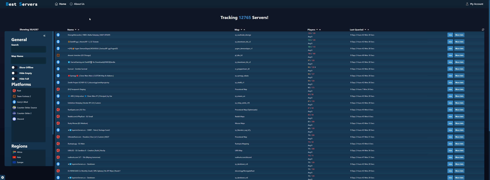

## Roadmap
Our roadmap, milestones, and progression may be viewed [here](https://github.com/bestserversio/bestservers/issues).

## Required Tools
Here is a list of required tools for Best Servers to run properly.

* [Spy](https://github.com/bestserversio/spy) - Adds servers from the [Valve Master Server](https://developer.valvesoftware.com/wiki/Master_Server_Query_Protocol) (VMS), updates game server information such as player/user counts, map names, and more.
* [Spy Discord](https://github.com/bestserversio/spy-discord) - A Discord bot that allows users to add Discord servers to Best Servers and keeps track of user counts.
* [Banner Forge](https://github.com/bestserversio/banner-forge) - Generates banners/images users can use to showcase specific game servers.

**Note** - Spy Discord and Banner Forge are currently not required and won't be for initial release.

## Installation
**To Do...**

## Configuration
**To Do...**

## Showcase

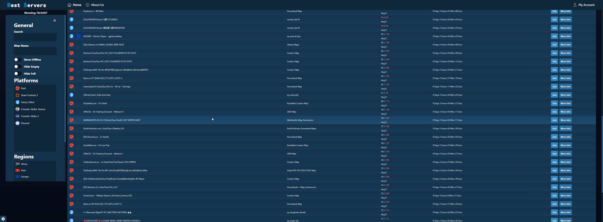

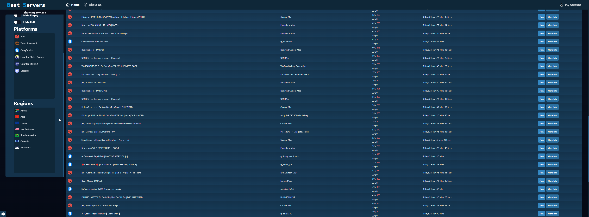

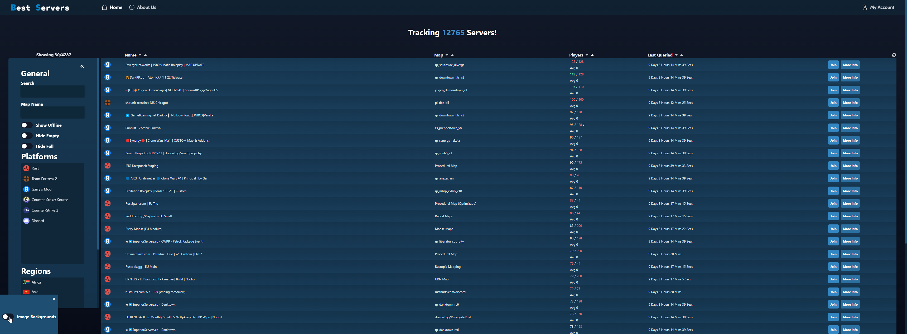

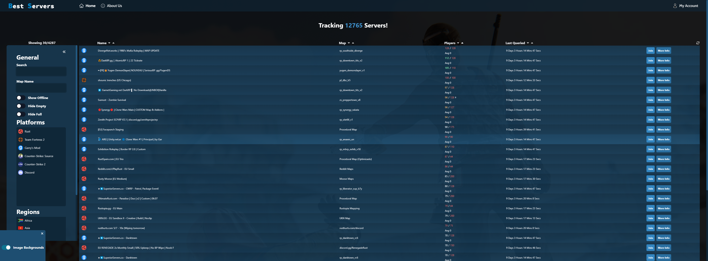

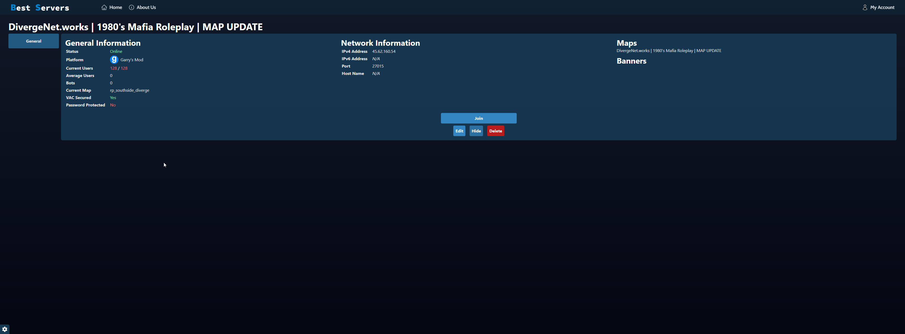

    
Admin Area

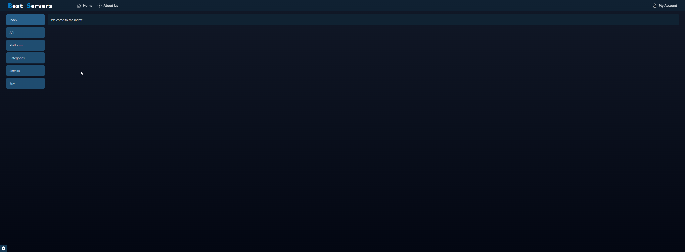

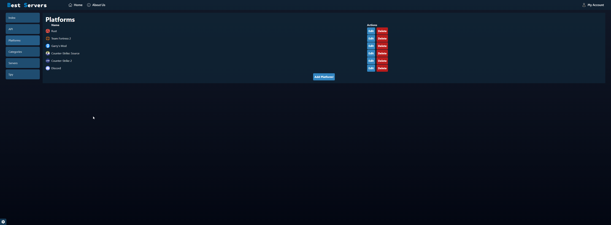

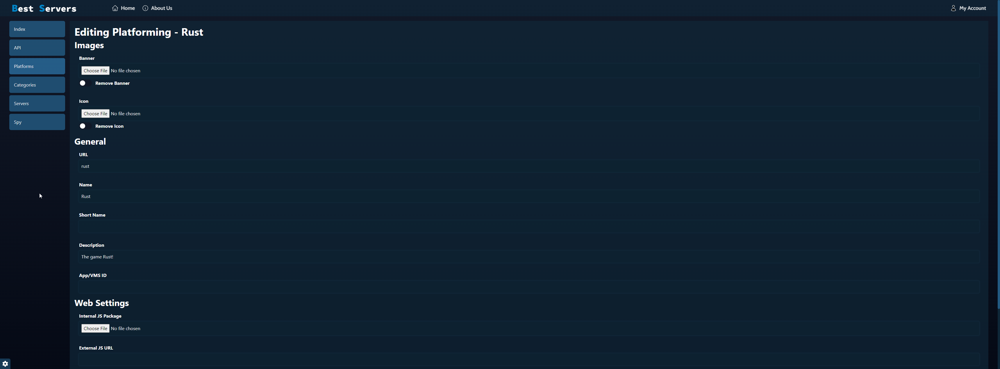

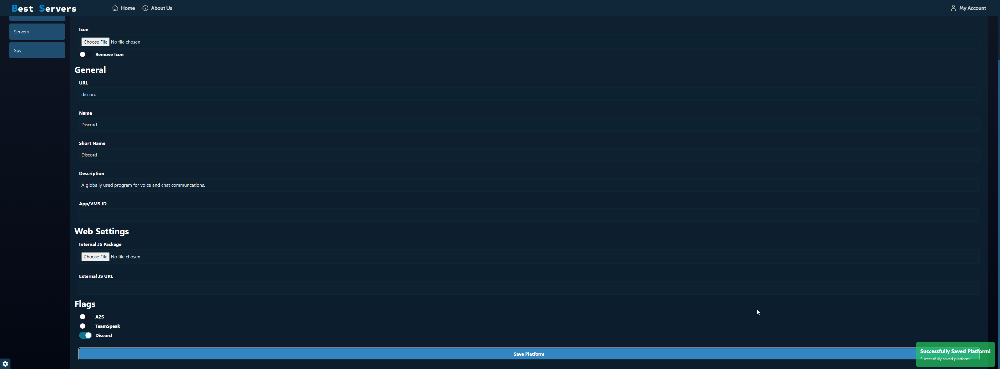

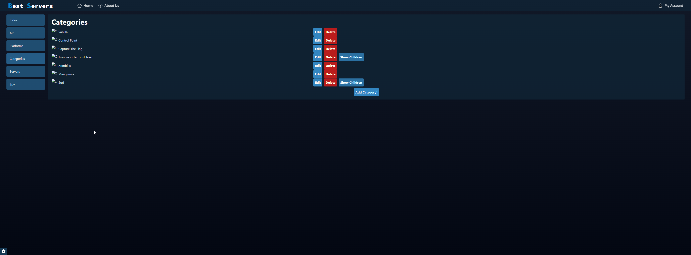

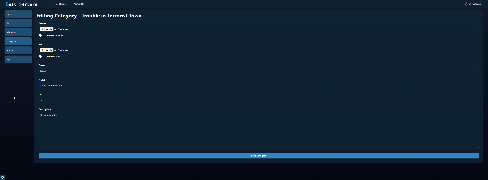

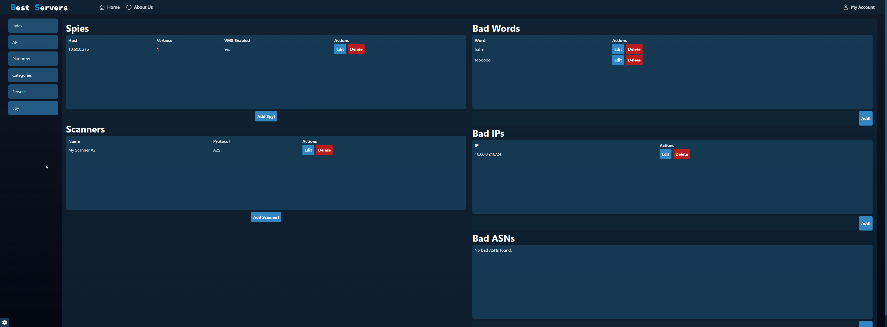

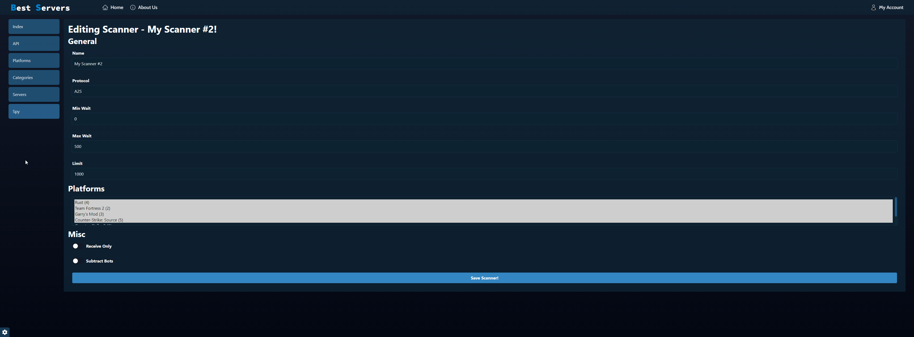

## Credits
* [Christian Deacon](https://github.com/gamemann)